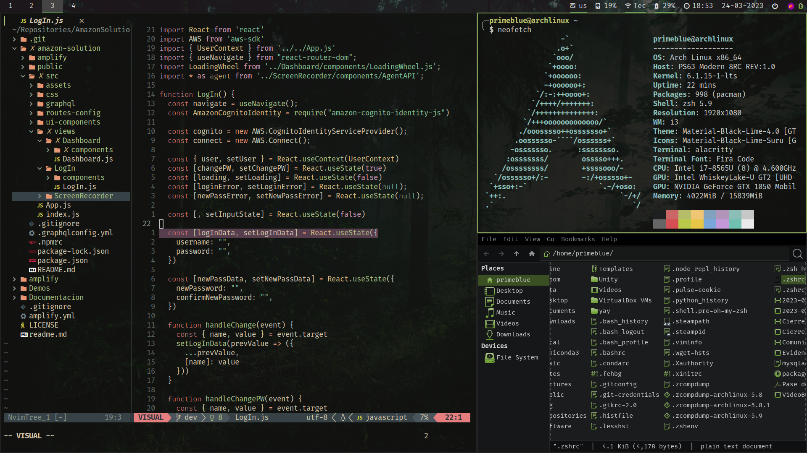

# My dotfiles repository

**This branch is in progress developing nord-theme**

Welcome to my dotfiles repository! Here you'll find my personalized configurations for various tools and applications on the Arch Linux distribution. These dotfiles help me create a highly personalized, efficient, and visually appealing development environment.

## What's inside?

This repository contains configurations for the following tools:

1. **Alacritty**: A fast and lightweight terminal emulator with GPU acceleration for improved performance.
2. **Neovim**: An extensible, highly configurable text editor designed for efficient text editing.
3. **i3**: A tiling window manager that provides a clean and minimal user interface, allowing you to manage windows without the need for a mouse.
4. **Picom**: A standalone X compositor, adding subtle effects like window transparency and shadows to enhance your desktop experience.
5. **Polybar**: A highly customizable status bar that integrates seamlessly with i3, displaying essential system information and application shortcuts.
6. **Thunar**: A lightweight and user-friendly file manager that offers a simple and intuitive interface for managing files and directories.



If you like what you see you I'll briefly show you how to use this repo

## Getting started

Before diving into the configurations, it's essential to have the necessary tools and applications installed on your Arch Linux system. You can install them using the following command:

```
sudo pacman -S alacritty neovim i3 picom polybar thunar
```

## Installation

To use these configurations, follow these steps:

1. Clone this repository to your preferred location:

```
git clone https://github.com/yourusername/dotfiles.git
```

2. Create symbolic links to the respective configuration directories in your home directory:

```
ln -s /path/to/your/dotfiles/alacritty ~/.config/alacritty
ln -s /path/to/your/dotfiles/neovim ~/.config/nvim
ln -s /path/to/your/dotfiles/i3 ~/.config/i3
ln -s /path/to/your/dotfiles/picom ~/.config/picom
ln -s /path/to/your/dotfiles/polybar ~/.config/polybar
ln -s /path/to/your/dotfiles/thunar ~/.config/Thunar
```

3. Restart your system or reload your configurations to see the changes.

## Customization

These configurations are designed to be modular and easily customizable. Feel free to explore the files, understand how they work, and tweak them to suit your preferences. I encourage you to make these dotfiles your own and create a development environment that reflects your personality and work style.

Enjoy! And if you have any questions or suggestions, please don't hesitate to reach out.
